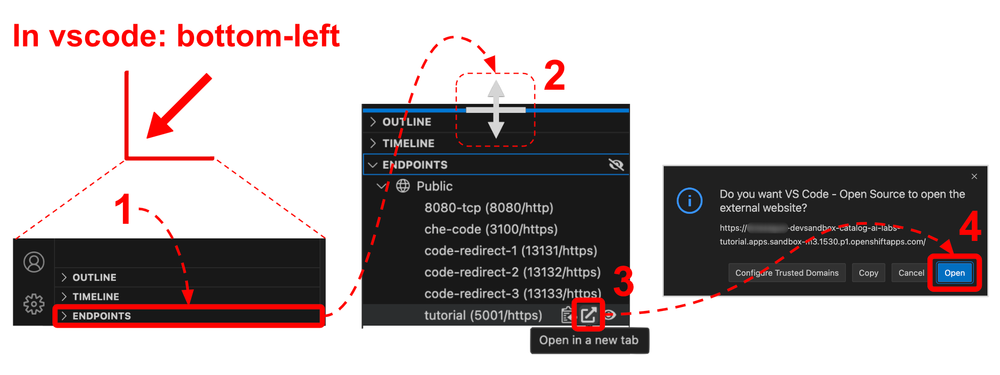
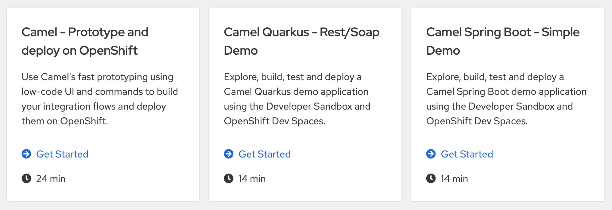
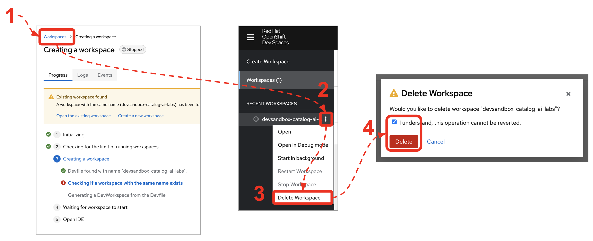

# Apache Camel in the Developer Sandbox

> [!NOTE]  
> If this file is rendered in TEXT mode in VS Code, click the preview button. \
> (upper-right corner, has a `📖+🔍` symbol)

Gain familiarity with *Apache Camel* by getting hands-on with easy exercises in the Developer Sandbox.

## Get started with the tutorials

> [!NOTE]  
> If using the Developer Sandbox for the first time, you'll be required to register for a Red Hat account.

To launch this tutorial, follow these simple steps:

1. If you haven't already done so, click the link below to provision the tutorial:

    <sub>(right-click & open in new tab)</sub> \
    [Provision Tutorial in the Developer Sandbox](https://workspaces.openshift.com/#https://github.com/RedHat-Middleware-Workshops/devsandbox-camel.git)
    <!-- <a target="_blank" href="https://workspaces.openshift.com/#https://github.com/RedHat-Middleware-Workshops/devsandbox-catalog-ai-labs.git">Provision Tutorial in the Developer Sandbox</a> -->

2. <sub>(In VS Code, open `Readme.md` in preview mode, if not showing automatically)</sub>

    Once provisioned, from VS Code in DevSpaces, unfold the `ENDPOINTS` group in the left panel and click the `Tutorial` link to open it in a new tab, as shown in the picture below:

    
    *Mouse actions in VS Code to open the tutorial.*

<br/>

3. From your new tab, select one of the available tutorials to get started:
    

<br/>

### How to recover from failed workspace

Sometimes the provisioning process goes wrong. \
Try following the steps below to delete the failed workspace and restart.

1. Click <span style="color:blue">Workspaces</span> at the top of the screen as illustrated below. \
   *Dev Spaces*'s dashboard will open.
  
2. Find the <kbd>⋮</kbd> button (failed workspace).

3. Select <kbd>Delete Workspace</kbd>

4. In the confirmation panel, **tick** the box, and click **Delete**


*Mouse actions in VS Code to delete failed workspace.*

After the actions above, retry provisioning your lab. \
Jump back to:
 - [Get started with the tutorial](#get-started-with-the-tutorials)

<br/>

## Introduction

This repository contains a collection of labs to run in the Developer Sandbox, a free to use OpenShift environment, where users can follow guided instructions to fully cover the material in a fully remote development platform.

<br>

## Available labs

The table below collects the labs currently available and the articles in Red Hat Developers they're based on.

Follow the link to the article to run the lab you're interested in.

|            Lab Name             | Preview in GitHub | Article | 
|:--------------------------------|:-------:|:-----------------:|
| Camel - Prototype and deploy on OpenShift             | [preview](docs/labs/camel/walkthrough.adoc) | [link](https://developers.redhat.com/articles/2024/11/15/try-apache-camel-concept-deployment-openshift)
| Camel Quarkus - Rest/Soap Demo  | [preview](docs/labs/camelq/walkthrough.adoc)| [link](https://developers.redhat.com/articles/2023/10/06/try-camel-quarkus-developer-sandbox-red-hat-openshift)
| Camel Spring Boot - Simple Demo  | [preview](docs/labs/camelsb/walkthrough.adoc)| [link](https://developers.redhat.com/articles/2023/02/10/how-run-camel-spring-boot-red-hat-developer-sandbox)


<br/>

## Contributing new labs

To include new labs to the collection, include the source code under a new folder and the documentation guide under `docs/labs` in a new folder.

You can test locally your guide instructions by running locally the Solution Explorer in a Docker instance using the following command:

```bash
docker run --rm -it --name solex -p 5001:5001 \
-v $PWD/docs/labs:/opt/user-walkthroughs \
-e NODE_ENV=production \
-e THREESCALE_WILDCARD_DOMAIN=local.localdomain \
-e OPENSHIFT_VERSION=4 \
-e WALKTHROUGH_LOCATIONS=/opt/user-walkthroughs quay.io/redhatintegration/tutorial-web-app:latest
```