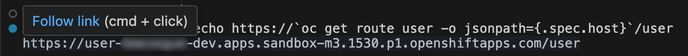

:walkthrough: Lab Introduction
:user-password: openshift
:namespace: {user-username}

:experimental:

// WORKS
:style-kbd: kbd { \
  color: black; \
  background-color: lightgrey; \
  border: 1px solid black; \
  box-shadow: 0px 1px black; \
  font-size: .85em; \
  line-height: .85em; \
  display: inline-block; \
  font-weight: 600; \
  letter-spacing: .05em; \
  padding: 3px 5px; \
  white-space: nowrap; \
  border-radius:5px; \
} \

:style-preview: pre {background-color: black; color: white}

// :style-indent: .indent2 {padding-left: 2rem;}

:style-all: pass:a[]
// :style-all: pass:a[]

:article-url: https://developers.redhat.com/articles/2024/11/15/try-apache-camel-concept-deployment-openshift
:ai-basics-article-url: https://developers.redhat.com/articles/2024/10/04/tutorial-tool-your-llm-apache-camel-openshift
// URLs
:codeready-url: http://codeready-che.{openshift-app-host}/

ifdef::env-github[]
endif::[]

[id='lab-intro']
= Camel - Prototype and deploy on OpenShift

Use Camel's fast prototyping using low-code UI and commands to build your integration flows and deploy them on OpenShift.

// Walk your first steps with Camel K by creating and running your first integration service that integrates with a legacy backend.

This hands-on lab is based on the following blog article in Red Hat Developers:

// * PENDING URL
* link:{article-url}[window="_blank", , id="rhd-source-article"]

{empty} +

The sequence diagram below illustrates the flow you're about to create.

{empty} +

The Camel integration will expose an HTTP entry point, and upon client requests, it'll fetch XML data from a (simulated) legacy backend, transform its response into JSON, and return it to the client application.

Assuming you have followed the article's instructions, you should be all set to get hands-on with _Camel_ in the _OpenShift Dev Spaces_ workspace.

{empty} +

[time=1]
[id="introduction"]
== Introduction

If you haven't used _Apache Camel_ before, or haven't played with recent versions and tools, it's important you read below all the pieces that are at play, and understand they are conceived to converge into providing a unified development experience.

To briefly introduce the set of tools you're about to use, here's a list of the components that will help you along the way:

- *Dev Spaces / VS Code*: the IDE you'll be using to create the _Camel_ processes.
- *Apache Camel*: the integration framework you'll use packed with Enterprise Integration Patterns and Components (connectors).
- *Kaoto*: visual editor for _Apache Camel_ to create your _Camel_ routes and processes in VS Code.
- *Camel JBang*: _Camel_ CLI (command line interface) designed to boost prototyping and accelerate your work to create, test and deploy your applications.
- *Quarkus*: The runtime used by _Camel_ to deploy your integration processes on _OpenShift_
- *OpenShift*: _Kubernetes_ environment where you will deploy your _Camel_ project.
- *OpenShift client*: OpenShift's CLI (command line interface) to help users manage projects in the environment.

{empty} +

=== No Java

One big highlight of the exercises you're about to embark on is that although _Apache Camel_ is _Java_ based, you won't see a single line of _Java_, nor have to define or manage dependencies. Those concerns are kept hidden to allow the developer become more productive by focussing on the business case at hand.

NOTE: It goes without saying that at any moment in time _Java_ code can be injected within your _Apache Camel_ processes to incorporate the custom handling you need. _Apache Camel_ excels in this respect thanks to its open framework architecture and extensibility.

{empty} +

[time=2]
[id="preparations"]
== Lab Preparations
{style-all}

Before we start real work, let's prepare the equipment before riding the _Camel_.

{empty} +

=== Enable auto-save

TIP: Ignore this step if auto-save is already enabled in your environment.

. Toggle auto-save on (✓)
+
You'll be making live code changes which _Camel_ can pick up in real time. When the file is saved Camel hot-reloads the changes. +
To speed up hot-reloads, toggle (✓) auto-save in your editor, as illustrated below:
+

+
WARNING: The auto-save option in the menu does not always show when it's active/inactive. If you see in your editor's file tab a permanent white dot `⭘` when you make changes, it means auto-save is OFF.

{empty} +

=== Open a terminal

From DevSpaces, open a terminal following the steps illustrated below:

{empty} +

=== Copy/Paste commands

You'll use command actions all along the lab. +
To execute commands, perform the steps described below, as illustrated:

{blank}

. Click the button _Copy to clipboard_
. Paste the command in the terminal:
- on Linux: kbd:[Ctrl+Shift+v]
- on Mac: kbd:[⌘+v]
+
. Try it with:
+
[source, subs=]
----
echo "this is a copy/paste test" 
----
+
--
WARNING: It's been reported that these key-combos not always work. Your machine may not respond to the above descriptions. Please try other key or mouse click alternatives, for example, right-click, or middle-click.
--

. If the paste action fails and you see _DevSpaces_ showing the following notification:
+

+
{blank}
+
Find in your web browser's settings where to enable clipboard permissions. The image below shows how to enable them using _Chrome_:
+

// +
// [TIP]
// ====
// If the paste action fails and you see DevSpaces showing the following notification:

// image::images/clipboard-notification.png[width=50%]

// {blank}

// Find in your web browser's settings where to enable clipboard permissions. The image below shows how to enable them using _Chrome_:

// image::images/clipboard-settings.png[width=100%]

// ====

{empty} +

=== Prepare your working folder

. Create a working folder
+
Execute the commands below to create a new directory from where you can work and is visible in your project explorer:
+
[source, subs=]
----
mkdir lab && cd lab 
----
+
{empty} +

. Set your working project in _OpenShift_
+
Make sure your CLI `oc` client (_OpenShift_ client) points to your personal _Developer Sandbox_ project (aka namespace):
+
[source, subs=]
----
oc project $WORKSPACE_NAMESPACE 
----
+
NOTE: The _Developer Sandbox_ only allows 1 project (namespace) per user.
+
The command above should output something similar to:
+
----
Already on project "<your-username>--dev" on server "https://172.30.0.1:443".
----
+
{blank}
+
WARNING: Not specifying your target project (namespace) in _OpenShift_ may result in a deployment failure.
+
{empty} +

=== Tips for a better learning

If you have a wide monitor, or can organise your browser tabs in a multi-monitor configuration, it is mostly recommended to position your _DevSpaces_ view and your lab instructions side by side, as per the image below:

{empty} +

You're now all set and ready start riding the _Camel_.

{empty} +

[type=verification]
Is your terminal open and located in your `lab` directory?

[type=verificationSuccess]
👍 You're ready to roll!

[type=verificationFail]
Review the instructions above and ensure you run the `setup` script.

[time=5]
[id="base-route"]
== Base Camel route
{style-all}

This section introduces you to _Camel JBang_. You will use it to create your base _Camel_ route and explore some of things you can during the development phase.

{empty} +

. Create your initial integration definition
+
Make sure you're working from your `lab` directory:
+
[source, subs=]
----
cd /projects/devsandbox-camel/lab 
----
+
{blank}
+
To swiftly create a skeleton _Camel_ route definition, we can use the `camel` client ( link:https://camel.apache.org/manual/camel-jbang.html[_Camel JBang_, window="_blank", id="camel-jbang"] client) from the terminal. Execute the following command:
+
[source, subs=]
----
camel init user.camel.yaml 
----
+
{blank}
+
The above command initialises a YAML-based _Camel_ definition. Other languages, like Java and XML, are also supported.
+
{empty} +

. Open the route in the visual editor
+
You'll find your newly created integration file under the following path in your project explorer:
+
--
* `lab/user.camel.yaml`
+
{empty}
+

+
NOTE: Ignore other _Camel_ resources (folders) in the project tree,  they belong to other lab tutorials included in the same _GitHub_ repository.
--
+
{blank}
+
Click on the _Camel_ source file to display it in _Kaoto_ (_Camel_'s visual editor).
+

+
The visual editor will show you the default _Camel_ route initialised in step 1, consisting in a timer-to-log processing flow that generates an event every second. Each execution defines a payload (body) and writes it to log.
+
{empty} +

. Run the integration with:
+
[source, subs=]
----
camel run * 
----
+
NOTE: the `*` indicates to load all source files in the folder.
+
{blank}
+
After Camel finishes the start up phase, you'll see a new trace every second, similar to:
+
----
2024-10-24 07:21:27.941  INFO ... : Hello Camel from route1
2024-10-24 07:21:28.941  INFO ... : Hello Camel from route1
2024-10-24 07:21:29.941  INFO ... : Hello Camel from route1
----

{empty} +

=== Explore more Camel JBang features

To quickly illustrate another useful feature, _Camel JBang_ includes a web based _Developer Console_.

Stop _Camel_ with kbd:[Ctrl+c]. +
And activate the _Developer Console_ using the flag `--console` as per the command below:

[source, subs=]
----
camel run * --console 
----

{blank}

_Dev Spaces_ will prompt you to open the port `8080`. +
Do so and, in your browser's address bar, change the URL's path to the following one:

- `/q/dev`

{blank}

NOTE: Make sure your browser uses plain `http://` (pass:[<s>https://</s>])

Follow the actions illustrated below to open in a new browser tab:

[width=50%, align=center]

{blank}

You'll find a ton of information you can access. +
Try for example:

- pass:[<u style="color:blue">top</u>: Display the top routes]
+
{blank}
+
When refreshing the page after a few LLM interactions, it should show something similar to:
+
++++
<pre style="background-color: white; color: black">
Top Routes:

    Route Id: route1
    From: timer://yaml?period=1000
    Source: file:user.camel.yaml:1
    Total: 73
    Failed: 0
    Inflight: 0
    Mean Time: 0ms
    Max Time: 8ms
    Min Time: 0ms
    Last Time: 0ms
    Delta Time: 0ms
    Total Time: 8ms
</pre>
++++

{empty} +

Another console option you can look at is:

- pass:[<u style="color:blue">source</u>: Dump route source code]
+
{blank}
+
It will render the source code of your _Camel_ route in YAML DSL:
+
++++
<pre style="background-color: white; color: black">
Source:

    Id: route1
    Source: file:user.camel.yaml:1

    #1 - from:
    #2     uri: "timer:yaml"
    #3     parameters:
    #4       period: "1000"
    #5     steps:
    #6       - setBody:
    #7           simple: "Hello Camel from ${routeId}"
    #8       - log: "${body}"
</pre>
++++

{empty} +

The examples from above show cool features (out of many) _Camel JBang_ includes. +
Feel free to explore more by reading its link:https://camel.apache.org/manual/camel-jbang.html[​documentation,window="_blank", , id="rhd-source-article"] page.  

// {empty} +

[TIP]
====

You can always invoke _Camel JBang_'s help command, from the terminal, to discover all options and flags available:

[source, subs=]
----
camel --help 
----

{blank}

You also have more granular help per-command. For example, try the following:

[source, subs=]
----
camel get --help 
----
====

{empty} +

[type=verification]
Is your base route created and have you seen other _Camel JBang_ options?

[type=verificationSuccess]
👍 You're ready to roll!

[type=verificationFail]
Please review the steps of this chapter and try again.

[time=5]
[id="development"]
== Fast Prototyping
{style-all}

This section shows you to prototype your project in fast iteration cycles. _Camel JBang's_ provides a *'developer mode'* that allows it to detect and apply on-the-fly any changes you perform.

To make the example interesting, the service you will create will operate as an adaptation layer, collecting data in XML format from a remote server and transforming it to JSON. This is a very typical use case where modern API façades serve data obtained from legacy systems.

Here's again the sequence diagram illustrating the process you're about to create.

{empty} +

Follow the commands below:

. If you haven't done so yet, stop Camel with kbd:[Ctrl+c].

. Run the integration in *'developer mode'*:
+
[source, subs=]
----
camel run * --dev 
----
+
NOTE: the `--dev` flag activates the developer mode.

. Start making changes in the _Camel_ route. 
+
Because you're running _Camel_ in developer mode, every change you do in the editor will trigger a hot-reload and automatic restart.
+
Update the `timer` definition. +
Look at the figure below and follow these steps:
+
--
. Click the timer activity to open the configuration pane.
. Click kbd:[All] (properties).
. Use the filter `repeat` to search and find properties.
. Set the `repeatCount` property to 1.
. Close the configuration pane.
--
+

+
{blank}
+
In the logs, you will see Camel react by restarting and executing the route only once, because `repeatCount` was set to 1:
+
----
2024-10-24 10:22:23.443  INFO ... : Routes reloaded summary (total:1 started:1)
2024-10-24 10:22:23.443  INFO ... :     Started route-4178 (timer://yaml) (source: user.camel.yaml:4)
2024-10-24 10:22:24.442  INFO ... : Hello Camel from route-4178
----
+
{empty} +

. Define an HTTPS call
+
.. Copy the endpoint URL below:
+
[source, subs=]
----
https://random-data-api.com/api/v2/users?response_type=xml
----
+
NOTE: The parameter `response_type` tells the server to return the data in XML format.
+
.. Look at the figure below and follow these steps:
+
--
. Click the 3 dots kbd:[*⋮*] in `setBody`.
. Click kbd:[⟳ Replace].
. Use the filter `https` to search and find the component.
. Select the HTTPS component.
. Click on the HTTPS step.
. Paste the URL (you copied above) in the `Http Uri` property.
. Close the configuration pane.
--
+

+
{blank}
+
In the logs, you will see _Camel_ reacting and fetching an XML response from the backend, similar to the sample lot traces below:
+
----
... : Routes reloaded summary (total:1 started:1)
... :     Started route-4178 (timer://yaml) (source: user.camel.yaml:4)
... : <?xml version="1.0" encoding="UTF-8"?>
<hash>
  <id type="integer">9582</id>
  <uid>837ec527-7925-4904-84ac-8b9113c2dbd8</uid>
  <password>iobemgl1ZH</password>
  <first-name>Carl</first-name>
  <last-name>Auer</last-name>
  <username>carl.auer</username>
  <email>carl.auer@email.com</email>
  ...
----
+
{empty} +

. Define an HTTP listener
+
Now, expose the process as a service. Replace the Timer event producer with an HTTP listener.
+
Look at the figure below and follow these steps:
+
--
. Click the 3 dots kbd:[*⋮*] in `timer`.
. Click kbd:[⟳ Replace].
. Use the filter `platform-http` to search and find the component.
. Select the *Platform HTTP* card.
. Click on the `platform-http` step.
. Set the Path property to:
+
[IMPORTANT]
====
[source, subs=]
----
/user
----
====
. Close the configuration pane.
--
+

+
{blank}
+
In the logs, you will see _Camel_ reacting with traces similar to:
+
----
... : Routes reloaded summary (total:1 started:1)
... :     Started route-4178 (platform-http:///user) (source: user.camel.yaml:5)
----
+
NOTE: In contrast with previous updates, this time no execution takes place as _Camel_ waits for HTTP requests to comes in.
+
{empty} +

. Clean incoming HTTP headers
+
To ensure the process cleanly calls the HTTP endpoint and to prevent header propagation, you need to include a step to clean the incoming HTTP headers.
+
Look at the figure below and follow these steps:
+
--
. Click the 3 dots kbd:[*⋮*] in `platform-http`.
. Click kbd:[+ Add step].
. Use the filter `removeheaders` to search and find the component.
. Select the *Remove Headers* card.
. Click on the `removeHeaders` step.
. Set the Pattern property to `*`.
. Close the configuration pane.
--
+

+
{blank}
+
At this point your Camel route should look in Kaoto as the picture below:
+

+
{blank}
+
In the logs, you should see _Camel_ having reacted from the updates above and showing the following traces:
+
----
... : Routes reloaded summary (total:1 started:1)
... :     Started route-4178 (platform-http:///user) (source: user.camel.yaml:5)
----
+
{empty} +

. Test the listener
+
To validate what you've done so far, test the listener from a new terminal. Choose the _Split_ option from the current terminal's top right corner, as shown below:
+
image::images/terminal-split.png[align="left", width=30%]
+
{blank}
+
From the new terminal, run the following cURL command to test your service:
+
[source, subs=]
----
curl -s http://localhost:8080/user | bat -pP -lxml 
----
+
NOTE: The command also includes a pipe to colorize the XML output for better reading.
+
The invocation should return an XML payload similar to:
+
----
<?xml version="1.0" encoding="UTF-8"?>
<hash>
  <id type="integer">9867</id>
  <uid>f7907251-4336-40d3-8502-a1021a1a10b4</uid>
  <password>KsbN09mckU</password>
  <first-name>Danny</first-name>
  <last-name>Stehr</last-name>
  <username>danny.stehr</username>
  <email>danny.stehr@email.com</email>
  ...
----
+
{blank}
+
So far so good.
+
{empty} +

. Apply XML to JSON transformation
+
Keep iterating the prototype by introducing XML to JSON translation.
+
In _Camel_ there are many strategies available to convert XML into JSON. In this case you will use the _Marshal/Unmarshal_ EIP to update the flow. You do it by adding two extra steps to the process: first _Unmarshal_ (XML) and then _Marshal_ (JSON).
+
====
.. Start by unmarshalling the XML data +
+
Look at the figure below and follow these steps:
+
--
. Right-click on the `https` step.
. Select the  kbd:[↓ Append] option.
. Use the filter `unmarshal` to search and find the component.
. Select the *Unmarshal* card.
. Click on the `unmarshal` step.
. Select the *Jackson XML* Data Format.
. Close the configuration pane.
--
+

+
.. Then marshal to JSON
+
Look at the figure below and follow these steps:
+
--
. Right-click on the `unmarshal` step.
. Select the  kbd:[↓ Append] option.
. Use the filter `marshal` to search and find the component.
. Select the *Marshal* card.
. Click on the `marshal` step.
. Select the *Json* Data Format.
. Close the configuration pane.
--
+

+
{blank}
====
+
At this point your Camel route should look in Kaoto as the picture below:
+

+
{blank}
+
In the logs, you should see _Camel_ having reacted from the updates above and showing the following traces:
+
----
... : Routes reloaded summary (total:1 started:1)
... :     Started route-4178 (platform-http:///user) (source: user.camel.yaml:5)
----
+
{empty} +

. Test the XML to JSON transformation
+
Test the Unmarshal/Marshal steps with the command below:
+
[source, subs=]
----
curl -s http://localhost:8080/user | jq 
----
+
NOTE: The command also includes a pipe to colorize the JSON output for better reading.
+
The invocation should return JSON data, similar to:
+
----
{
  "phone-number": "+63 890.053.3511 x6876",
  "address": {
    "city": "Feestport",
    "street-name": "Cecil Camp",
    "street-address": "12806 Abbott Summit",
  ...
----
+
{empty} +

[type=verification]
Did your last curl command return JSON data?

[type=verificationSuccess]
Well done !!

[type=verificationFail]
Go back in your footsteps and review the actions.

[time=5]
[id="deploy-integration"]
== Deploy your integration
{style-all}

You've completed your prototype, it is time to deploy it. +
The _Camel_ CLI (_Camel JBang_) includes a _Kubernetes_ plugin that makes it very easy to deploy your application on Openshift.

Camel JBang and the _Kubernetes_ plugin will do all the work for you. Your code gets analysed and all the necessary dependencies automatically detected and downloaded, then containerised and deployed on Openshift.

Follow the commands below:

. If you haven't done so already, stop Camel with kbd:[Ctrl+c].
. Make sure you're working from your `lab` directory:
+
[source, subs=]
----
cd /projects/devsandbox-camel/lab 
----
+
. Run the following command from your terminal to deploy your application:
+
[source, subs=]
----
camel kubernetes run * --cluster-type=openshift --trait route.enabled=true --trait route.tls-termination=edge 
----
+
[NOTE]
====
- The `--cluster-type` flag indicates the _Kubernetes_ flavour of your target environment.
- The `route.enabled=true` trait indicates to create an Openshift route to allow external access.
- The `route.tls-termination=edge` trait enables secure HTTP (HTTPS).
====
+
{blank}
+
The execution will export the code into a Camel Quarkus application and deploy it on Openshift.
+
NOTE: Be patient, the execution may take 3 to 5 minutes the first time as _Camel_ analyses the code, downloads required dependencies, builds  and deploys the application.
+
In the logs you'll see following traces:
+
----
...
Exporting application ...
Deploying to Openshift ...
Invalid AnsiLogger Stream -> Swapping to default sdt out logger.
[INFO] Adding existing Deployment with name: user.
[INFO] Adding existing Service with name: user.
[INFO] Adding existing Route with name: user.
----

{empty} +

=== Check your deployment

You can inspect when your deployment is ready by issuing the following command:

[source, subs=]
----
watch oc get deployments 
----

{blank}

Your Camel application will be ready when `user` shows `READY 1/1`, similar to the output below:

----
NAME                        READY   UP-TO-DATE   AVAILABLE   AGE
user                        1/1     1            1           4m25s
workspace7c6e32fd061c4d25   1/1     1            1           17m
----

TIP: Stop the watch with kbd:[Ctrl+c].

{empty} +

=== Open the Developer Console

You can also visually inspect your pod by opening _Openshift's Developer Console_ following the actions below:

--
. At the bottom-left of your screen, click the kbd:[pass:[&gt;&lt;]] button.
. Then at the top, select:
- `Dev Spaces: Open OpenShift Console`
. If a list of namespaces shows, select your namespace.
. Your Camel Quarkus Application is labelled with `user`.
--

image::images/openshift-developer-console.png[align="left", width=100%]

{empty} +

[type=verification]
Do you see your Camel application deployed in the Developer Console?

[type=verificationSuccess]
Well done !!

[type=verificationFail]
Review the instructions and try again.

[time=2]
[id="test-integration"]
== Test your deployed integration
{style-all}

- Because the application has been deployed alongside your _DevSpaces_ workspace pod (see picture below), in the same _OpenShift_ namespace, you can call it from your same subnet.
+

+
{blank}
+
Use the following command to test the deployed application:
+
[source, subs=]
----
curl -s http://user:80/user | jq 
----
NOTE: you can directly call the service `user` on port 80 because the pod runs in the same namespace.
+
{blank}
+
Again, you should see a similar JSON response as per your previous test run locally.
+
----
{
  "phone-number": "+375 1-790-160-4090 x0991",
  "address": {
    "city": "East Justinafurt",
    "street-name": "Jerde Club",
    "street-address": "860 Yaeko Ramp",
    ...
----

{empty} +

=== Test the service using its external URL

- When the Camel application was deployed using the _Kubernetes_ plugin, the command included the `route.enabled` setting to expose the service for external consumption. 
+
Use the route to call the service as if it was an external call. Follow the commands below:
+
[source, subs=]
----
echo https://`oc get route user -o jsonpath={.spec.host}`/user 
----
+
{blank}
+
Then, use the URL generated on a browser tab or click as indicated, like in the image below:
+

+
{blank}
+
You should see in your browser the JSON response obtained, similar to:
+

+
TIP: When using _Chrome_, you can tick on the Pretty print check box to beautify the JSON response
+
{empty} +

[type=verification]
Did you succeed to invoke the `user` service as an external consumer?

[type=verificationSuccess]
Well done !! 

[type=verificationFail]
Make sure your route exists, and you're using the `/user` path.

{empty} +

[time=2]
[id="undeploy-integration"]
== Undeploy your Camel integration
{style-all}

The list below summarises the main resources created by the _Camel Kubernetes_ plugin during the deployment process on _OpenShift_:

- an _ImageStream_: your application containerised.
- a _Deployment_: your application deployment definition
- a _Service_: a _Kubernetes_ service to access your _Camel_ integration.
- a _Route_: an _OpenShift_ route to expose the service to external clients.

{blank}

If you wanted to undeploy your application to free up resources in the environment you would need to manually delete the items on the list above, plus additional residual (not listed) resources.

Thankfully, the _Camel Kubernetes_ plugin makes it super simple to undeploy your integration in one single command.

Execute the command below to remove `user` from your namespace:

[source, subs=]
----
camel kubernetes delete user 
----

{blank}

In your terminal, you should see an execution output similar to:

----
Deleted: Service 'user'
Deleted: Imagestreams 'openjdk-17'
Deleted: Imagestreams 'user'
Deleted: Buildconfigs 'user'
Deleted: Deployments 'user'
Deleted: Routes 'user'
----

{blank}

Verify your deployment has been deleted by issuing the following _Openshift_ command:

[source, subs=]
----
oc get deployments 
----

{blank}

The command should return your workspace deployment only:

----
NAME                        READY   UP-TO-DATE   AVAILABLE   AGE
workspace7c6e32fd061c4d25   1/1     1            1           16m
----

{empty} +

[type=verification]
Did you manage to successfully undeploy your `user` Camel integration?

[type=verificationSuccess]
Well done !!

[type=verificationFail]
Review the instructions in this chapter and try again.

{empty} +

[time=1]
[id="section-learn"]
== More Camel examples to learn from
// == Take the solution further ahead
{style-all}

{empty} +

=== 👏 👏 👏 Congratulations for getting this far 👏 👏 👏

{empty} +

For those thirsty of knowledge willing to learn more about other _Camel_ use cases we strongly recommend to try out another exciting tutorial.

Follow the link below to visit the introductory article that will take you to the learning material:

* link:{ai-basics-article-url}[​​Tool up your LLM with Apache Camel on OpenShift,window="_blank", , id="rhd-source-article"]

{empty} +

WARNING: Before you go, please make sure you clean your sandbox namespace to free up resources. +
Click `pass:[<mark style="background-color: dodgerblue; color: white">&nbsp;Next&nbsp;</mark>]` for detailed instructions.

[time=1]
[id="section-clean"]
== Clean up your Developer Sandbox account
{style-all}

Before you go, make sure you leave your account clean from artifacts so that you can play with other tutorials in the future or simply do solo experimentation.

{empty} +

=== Delete workspace in Dev Spaces 

When you're done playing with the workspace, follow the guidance below to delete it entirely from the environment.

WARNING: Your VSCode environment along with these lab instructions will be deleted from your sandbox.

First, stop your workspace by following the actions below: 

. At the bottom-left of your screen, click the kbd:[pass:[&gt;&lt;]] button.
. Then at the top, select:
- `Dev Spaces: Stop Workspace`

{blank}

Stopping your workspace will make your browser switch to the Dev Spaces dashboard.

From the dashboard, follow the steps indicated below:

. Click *_Workspaces_*, from the left menu.
. Tick the checkbox for `devsandbox-catalog-ai-labs`.
. Click the button `pass:[<mark style="background-color: navy; color: white">&nbsp;Delete&nbsp;</mark>]`.
+
{blank}
+

{empty} +

[type=verification]
Is your namespace clean from artifacts?

[type=verificationSuccess]
You've successfully cleaned up your namespace !!

[type=verificationFail]
Review the instructions in this chapter and try again.

{empty} +
