:walkthrough: Lab Introduction
:user-password: openshift
:namespace: {user-username}

:experimental:

:article-url: https://developers.redhat.com/articles/2023/02/10/how-run-camel-spring-boot-red-hat-developer-sandbox

// URLs
:codeready-url: http://codeready-che.{openshift-app-host}/

ifdef::env-github[]
endif::[]

[id='lab-intro']
= Camel Spring Boot - Simple Demo

Explore, build, test and deploy a Camel Spring Boot demo application using the Developer Sandbox and OpenShift Dev Spaces.

This hands-on lab is based on the following blog article in Red Hat Developers:

* link:{article-url}[window="_blank", , id="rhd-source-article"]

{empty} +

Assuming you have followed the article's instructions, you should be all set to get hands-on with _Camel Spring Boot_ in the _OpenShift Dev Spaces_ workspace.

For illustration purposes, the picture below shows what the integration end-to-end flow looks like.

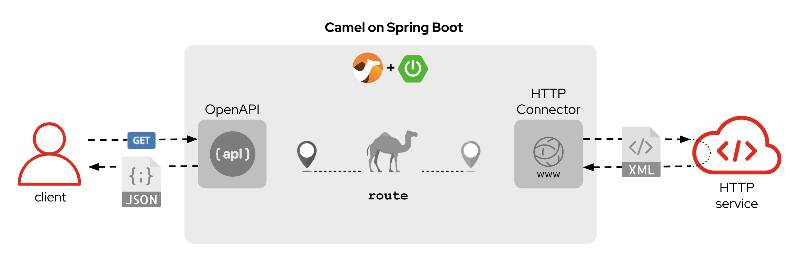

A client invokes an OpenApi service. A _Camel_ route attends the call, translates the JSON input into XML and calls a backend service to obtain an XML response, then it's translated back to JSON before responding to the original service call.

{empty} +

[time=1]
[id="explore-code"]
== Explore the source code

The _Camel_ source file `api-simple.xml` defines the entire end-to-end processing logic, which you can find in your project explorer under the path:

--
* `camelsb/level1simple/src/main/resources/camel/api-simple.xml`
+
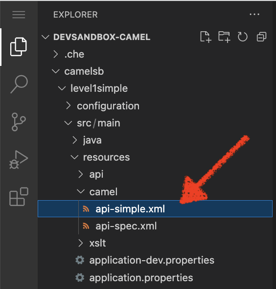
+
{blank}
+
Click on the Camel source file to display it in your code editor.
--

{empty} +

Inside the Camel source you'll see the main route definition:

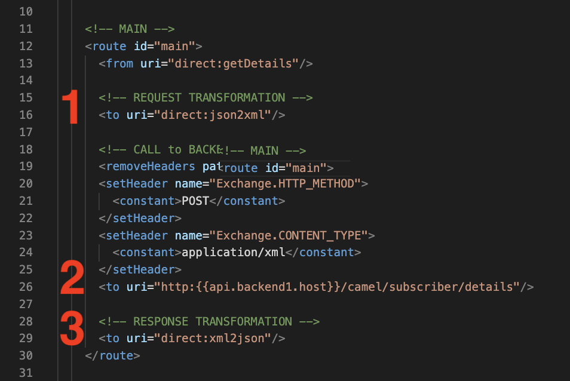

{blank}

The key processing actions are:

. Performs the JSON to XML transformation
. Invokes the backend service
. Transforms the XML response into JSON

{blank}

The code above is written using the XML DSL (_Domain Specific Language_), but Camel also provides a Java DSL and a YAML DSL.

Feel free to explore other regions of the code and project if you are curious about the entire implementation.

{empty} +

[time=3]
[id="terminal-stub"]
== Run the stub in your terminal

The stub acts as the backend service that provides the XML data we need to fetch.

{empty} +

. Open your terminal
+
Make sure you make your terminal visible in the IDE. You can toggle it using the keyboard keys kbd:[Ctrl + `] or simply find the option from the menu system as per the picture below:
+
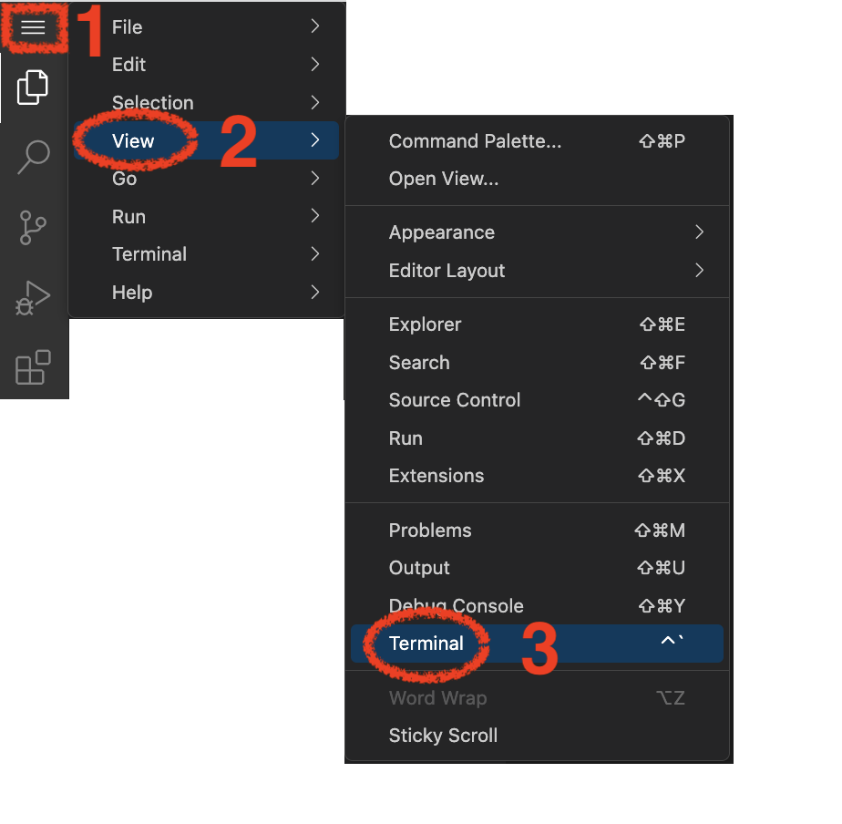

. Let's first run the stub
+
Copy and paste the following command in your terminal to place yourself in the stub's Camel Spring Boot project:
+
[source, subs=]
----
cd camelsb/stubs/end1 
----
+
{blank}
+
Then, copy/paste the following command to start the stub in the terminal:
+
[source, subs=]
----
mvn -Dspring-boot.run.profiles=dev -s configuration/settings.xml 
----
+
{blank}
+
--
* After _Maven_ downloads all the dependencies, you should see in your terminal logs that the stub has started:
+
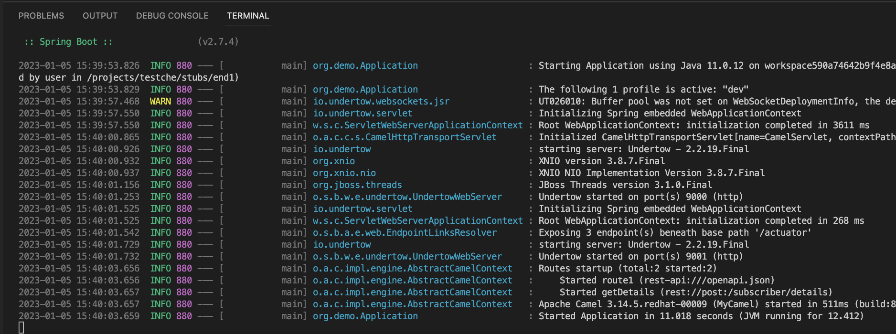
+
NOTE: Two notifications will pop up to inform you of new listening ports. You can ignore these messages; they will automatically close after a few seconds.
--
+
{empty} +
+
Now, test your stub from a new terminal. From your terminal's top right corner, choose the Split option, as shown below:
+
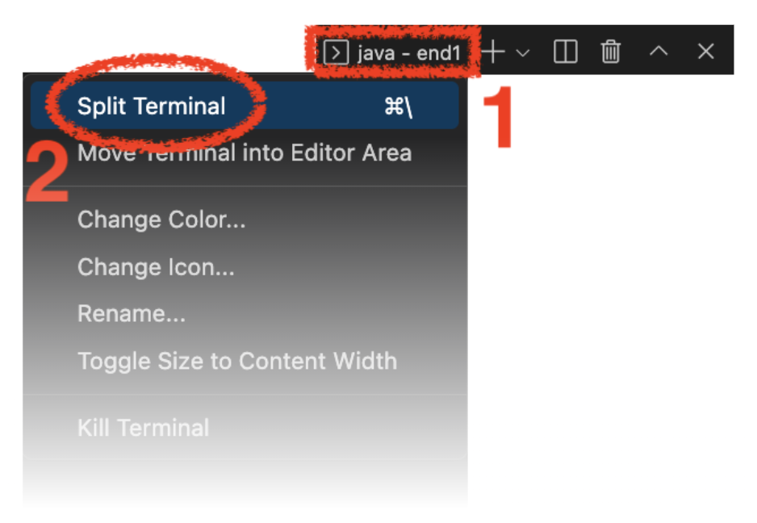
+
{blank}
+
Copy/paste the following cURL command to obtain a response from the stub:
+
[source, subs=]
----
curl -s \
-H "content-type: application/xml" \
-d '' \
http://localhost:9000/camel/subscriber/details \
| bat -pP -lxml 
----
+
NOTE: The command also includes a pipe to colorize the XML output for better reading.
+
{blank}
+
The invocation should return an XML payload similar to:
+
----
<Individual>
    <Name>Some</Name>
    <Surname>One</Surname>
    <Address>
        <Number>1</Number>
        <Street>Some Street</Street>
        <City>Somewhere</City>
        <PostCode>SOME C0D3</PostCode>
        <Country>UK</Country>
    </Address>
</Individual>
----

{empty} +

[type=verification]
Did you obtain the same XML message as shown above?

[type=verificationSuccess]
You've successfully tested the stub !!

[type=verificationFail]
Inspect in the stub logs to investigate the possible causes of failure.

[time=2]
[id="terminal-service"]
== Run the service in your terminal

The main _Camel_ service exposes a JSON REST API and integrates with the XML backend service (the stub).

{empty} +

. Run the main service
+
Copy and paste the following command in your terminal to place yourself in the main Camel Spring Boot project:
+
[source, subs=]
----
cd /projects/devsandbox-camel/camelsb/level1simple/ 
----
+
{blank}
+
Then, copy/paste the following command to start the stub in the terminal:
+
[source, subs=]
----
mvn -Dspring-boot.run.profiles=dev -s configuration/settings.xml 
----
+
{blank}
+
--
* Some more dependencies will be downloaded before the engine starts. When done, you should see logs of both systems in both terminals:
+
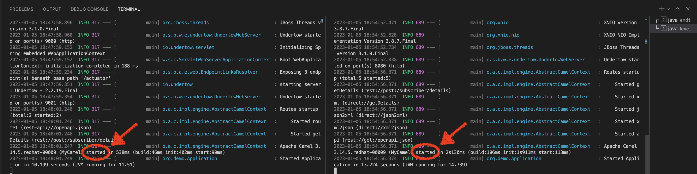
+
NOTE: More notifications pop up about the new listening ports. You can ignore these messages; they will automatically close after a few seconds.
--

+
{blank}
+
Open a third terminal from which you can issue commands. From your terminal's top right corner, choose the Split option as shown below:
+
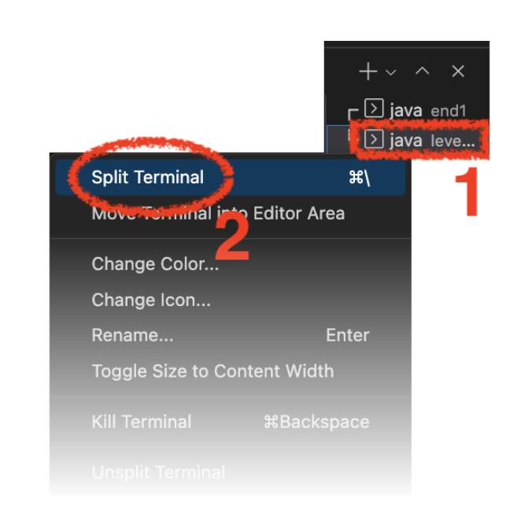
+
{blank}
+
Copy/paste the following cURL command to obtain a response from the stub:
+
[source, subs=]
----
curl -s \
-H "content-type: application/json" \
-d '{"id":"123"}' \
http://localhost:8080/camel/subscriber/details | jq 
----
+
NOTE: The command includes a pipe to parse the JSON response with JQuery, which nicely renders the returned JSON payload.
+
{blank}
+
The cURL command should return a JSON payload similar to:
+
----
{
  "fullName": "Some One",
  "addressLine1": "1 Some Street",
  "addressLine2": "Somewhere SOME C0D3",
  "addressLine3": "UK"
}
----

{empty} +

[type=verification]
Did you obtain the same JSON response as the one shown above?

[type=verificationSuccess]
You've successfully tested the main service !!

[type=verificationFail]
Inspect in the stub logs to investigate possible causes of failure.

[time=3]
[id="deploy-stub"]
== Deploy and test the stub

The stub acts as the backend service that provides the XML data we need to fetch.

{empty} +

. Stop both systems
+
Make sure you stop both the stub and the main service by selecting each terminal and pressing the keys kbd:[Ctrl + c]. Your view of your terminals should look like:
+
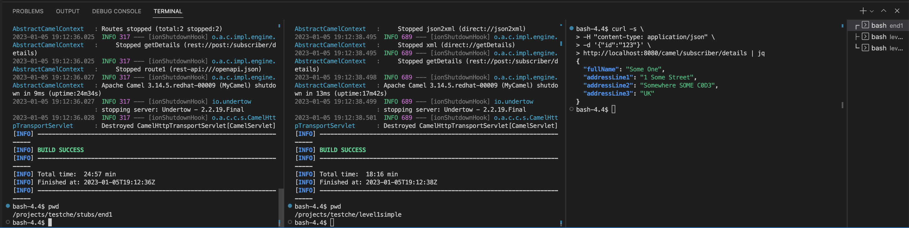
+
{empty} +
+
. Deploy the stub
+
Make sure your CLI `oc` client (_OpenShift_ client) points to your _Developer Sandbox_ project (aka namespace):
+
[source, subs=]
----
oc projects -q | grep dev | xargs oc project 
----
+
NOTE: The _Developer Sandbox_ only allows 1 project (namespace) per user.
+
The command above should output something similar to:
+
----
Now using project "<your-username>-dev" on server "https://172.30.0.1:443".
----
+
{blank}
+
WARNING: Not specifying your target project (namespace) in _OpenShift_ may result in a deployment failure.
+
{empty} +
+
You can now copy and paste the following command in your terminal to trigger the deployment:
+
[source, subs=]
----
mvn oc:deploy -Popenshift -s configuration/settings.xml 
----
+
{blank}
+
--
* You'll see Maven fetching more dependencies and then interact with OpenShift to finalise the deployment of the stub.
+
When done, if successful, going back to your browser's tab with your _OpenShift's_ developer topology view, you should see the new service up and ready when fully started, looking similar to:
+
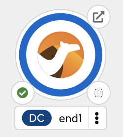
--
+
{empty} +
+
. Test the stub
+
Copy/paste the following cURL command to obtain a response from the stub:
+
[source, subs=]
----
curl -s \
-H "content-type: application/xml" \
-d '' \
http://end1:8080/camel/subscriber/details \
| bat -pP -lxml 
----
+
NOTE: The cURL command above now points to the newly deployed pod, with its service `end1` listening on port 8080.
+
NOTE: The command also includes a pipe to colorise the XML output for better reading.
+
{blank}
+
The invocation should return an XML payload similar to:
+
----
<Individual>
    <Name>Some</Name>
    <Surname>One</Surname>
    <Address>
        <Number>1</Number>
        <Street>Some Street</Street>
        <City>Somewhere</City>
        <PostCode>SOME C0D3</PostCode>
        <Country>UK</Country>
    </Address>
</Individual>
----

{empty} +

[type=verification]
Did you obtain the same XML message as shown above?

[type=verificationSuccess]
You've successfully tested the stub deployed in the sandbox !!

[type=verificationFail]
Inspect in the stub logs to investigate possible causes of failure.

[time=4]
[id="deploy-service"]
== Deploy and test the main service

With the stub already deployed, we just need to deploy the service which will integrate with the stub running under the same namespace.

{empty} +

. Deploy the service
+
Ensure you run the commands below from the terminal located in the path of your main service project.
+
You can now copy and paste the following command in your terminal to trigger the deployment:
+
[source, subs=]
----
mvn oc:deploy -Popenshift -s configuration/settings.xml 
----
+
{blank}
+
--
* Maven will interact with OpenShift to deploy the service.
+
When done, if successful, going back to your browser's tab with your _OpenShift's_ developer topology view, you should see both services available, the main service and the stub, up and ready when fully started, looking similar to:
+
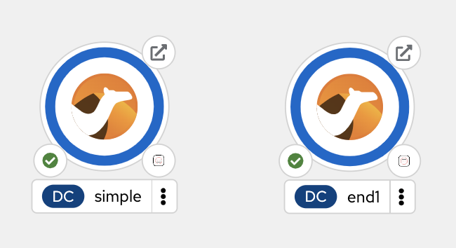
--
+
{empty} +
+
. Test the service
+
Copy/paste the following cURL command to obtain a response from the `simple` service:
+
[source, subs=]
----
curl -s \
-H "content-type: application/json" \
-d '{"id":"123"}' \
http://simple:8080/camel/subscriber/details | jq 
----
+
NOTE: The cURL command above now points to the newly deployed pod's _Kubernetes_ service `simple`, listening on port 8080.
+
NOTE: The command also includes a pipe to parse and colorise the JSON output for better reading.
+
{blank}
+
The invocation should return a JSON payload similar to:
+
----
{
  "fullName": "Some One",
  "addressLine1": "1 Some Street",
  "addressLine2": "Somewhere SOME C0D3",
  "addressLine3": "UK"
}
----
+
{empty} +
+
. Invoke the service as an external client
+
Notice the previous cURL command uses an internal service URL, which is not directly accessible by external consumers. However, the deployment automatically creates a route in OpenShift that exposes the service to external clients.
+
You can obtain the route details with the following command and use its URL from your favourite local HTTP client/tester, like _Postman_, _Swagger_ or others.
+
[source, subs=]
----
oc get route simple 
----
+
{blank}
+
Embedding the `oc get route` command in a cURL allows you to invoke the service as an external consumer.
+
--
* Copy/paste the following cURL to obtain the service _OpenAPI_ definition: 
+
[source, subs=]
----
curl -s http://`oc get route simple -o jsonpath={.spec.host}`/camel/openapi.json | jq 
----
+
{blank}
+
The invocation should return the _OpenApi_ specification, similar to:
+
----
{
  "openapi": "3.0.2",
  "info": {
    "title": "Subscriber",
    "version": "1.0.0"
  },

  ...
----
+
{blank}
+
* Copy/paste the following cURL command to simulate an external call and obtain a response from the _Camel_ service:
+
[source, subs=]
----
curl -s \
-H "content-type: application/json" \
-d '{"id":"123"}' \
http://`oc get route simple -o jsonpath={.spec.host}`/camel/subscriber/details | jq 
----
+
{blank}
+
The invocation should return a JSON payload similar to:
+
----
{
  "fullName": "Some One",
  "addressLine1": "1 Some Street",
  "addressLine2": "Somewhere SOME C0D3",
  "addressLine3": "UK"
}
----
+
--

{empty} +

[type=verification]
Did you obtain the same JSON response as shown above?

[type=verificationSuccess]
You've successfully invoked the simple service as an external client !!

[type=verificationFail]
Inspect in the stub logs to investigate possible causes of failure.

{empty} +

[time=1]
[id="clean-up"]
== Clean up your namespace

When you're done playing in the _Developer Sandbox_, you can clean up your Sandbox namespace by un-deploying your Camel `simple` service and stub `end1` using the following _Maven_ `oc:undeploy` command for both:

[source, subs=]
----
mvn oc:undeploy -Popenshift -s configuration/settings.xml 
----

{blank}

Executing the command above for both services should leave your topology view clean from routes, services, and other Kubernetes artifacts in your namespace.

{empty} +

[type=verification]
Is your namespace clean from artifacts?

[type=verificationSuccess]
You've successfully cleaned up your namespace !!

[type=verificationFail]
Inspect in the logs to investigate possible causes of failure.

{empty} +
